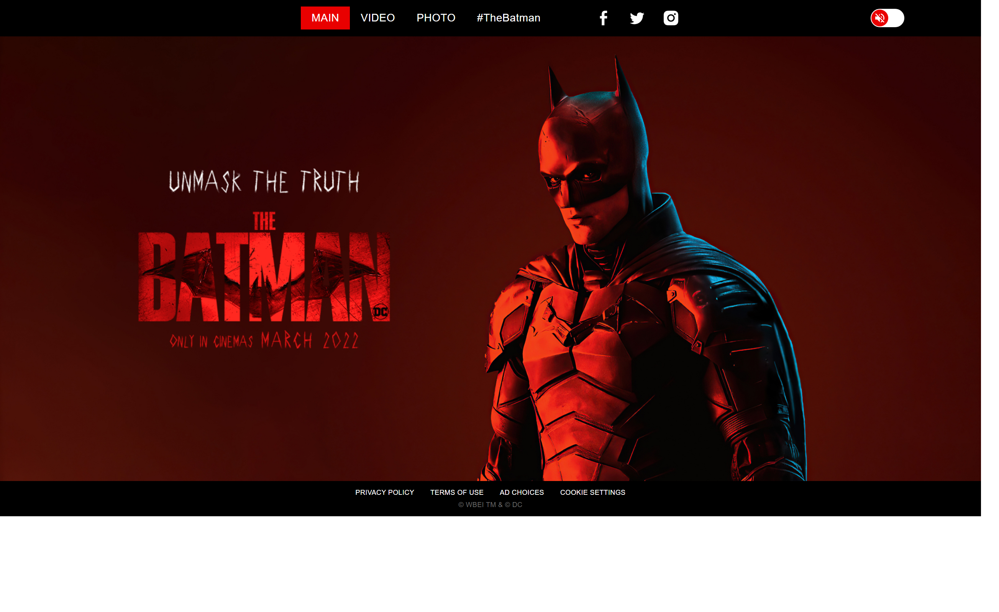

# Promotional Movie Site

It's a one page website for The Batman (2022) movie promotion. It has photo and video gallery and the main page. I created it based on predisigned Figma template.

[Explore the live version here!](https://darling-pudding-493c7d.netlify.app/index)

## What does it have? 

- Three pages (main, photo, video)
- Photo and video galleries with slider and thumbnails
- Background music you can turn on and off
- Special menu for mobile devices

## Features
- Cross-browser compatibility
- Responsive web design
- Infinity slider for photo and video galleries (thanks to [Swiper](https://swiperjs.com/))

## Stack
HTML, CSS, JavaScript.